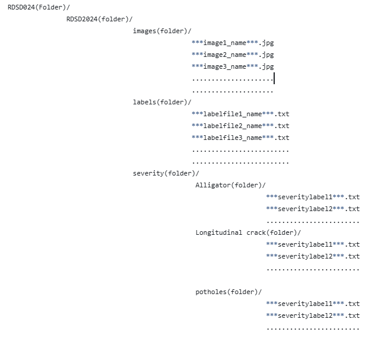
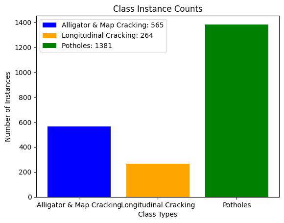

# RDSD2024
Our "Road damage dataset" contains 1700 images of Alligator and Map cracks, Longitudinal cracks, and potholes collected by a GoPro camera mounted on a vehicle's dashboard.
The dataset contains images of the above-mentioned damages with class labels, YOLOv8-style bounding box annotations, and severity labels( Large, medium, and Small). 
The dataset structure is as follows....
                                    
                                                                      
                                                                                     
                                                              
                                                        
  
